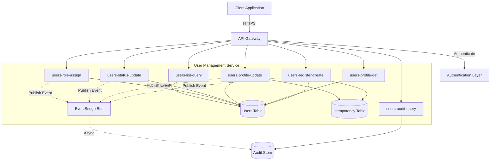

# Design Document: User Management Service

## Overview

The User Management Service is a Lambda-based REST API that provides core user identity management capabilities. The service follows a clean architecture with clear separation between API handlers (in `lambda/`), infrastructure definitions (in `deployments/`), and follows all established steering rules for security, testing, and observability.

### Key Design Decisions

1. **Lambda-per-operation pattern**: Each API operation has its own Lambda function for isolation and independent scaling
2. **DynamoDB for persistence**: Single-table design with GSIs for efficient querying
3. **Event-driven audit logging**: Audit events published to EventBridge for decoupled audit trail
4. **Idempotency via DynamoDB**: Separate idempotency table with TTL for automatic cleanup
5. **API Gateway REST API**: Standard REST endpoints with request validation
6. **No authorization logic**: Authentication only, no permission checks (per requirements)

### Architecture Principles Applied

- **Separation of concerns**: Lambda handlers delegate to service layer for business logic
- **Fail fast**: Input validation at API Gateway and Lambda entry points
- **Explicit over implicit**: All configurations via environment variables, validated at startup
- **Least privilege**: Each Lambda has minimal IAM permissions for its specific operations

## Architecture

### System Context



### Component Responsibilities

**API Gateway**
- Request routing and validation
- Authentication enforcement
- Rate limiting and throttling
- Request/response transformation

**Lambda Functions** (in `lambda/users/`)
- `register/`: Handle user registration
- `profile/`: Get and update user profiles
- `status/`: Manage user status lifecycle
- `roles/`: Assign and remove roles
- `list/`: Query and list users
- `audit/`: Retrieve audit logs

**DynamoDB Tables**
- `Users`: Primary user data store
- `Idempotency`: Idempotency key tracking with 24h TTL

**EventBridge**
- Audit event distribution
- Decouples audit logging from primary operations

### Data Flow

**User Registration Flow:**
1. Client sends POST /users with registration data
2. API Gateway validates request schema and authentication
3. `users-register-create` Lambda receives request
4. Lambda checks idempotency key in Idempotency table
5. Lambda validates email uniqueness by querying USER_EMAIL# partition
6. Lambda generates unique User_ID (ULID)
7. Lambda writes user record to Users table (both USER# and USER_EMAIL# items)
8. Lambda writes idempotency record
9. Lambda publishes audit event to EventBridge
10. Lambda returns user data to client

**User Update Flow:**
1. Client sends PATCH /users/{userId} with update data
2. API Gateway validates request and authentication
3. `users-profile-update` Lambda receives request
4. Lambda checks idempotency key
5. Lambda retrieves existing user record
6. Lambda validates update (no User_ID modification, user exists)
7. Lambda applies updates and writes to Users table
8. Lambda publishes audit event with before/after values
9. Lambda returns updated user data

## Components and Interfaces

### API Contract

All endpoints follow REST conventions and return consistent error shapes per steering rules.

#### POST /users (Register User)

**Request:**
```json
{
  "idempotencyKey": "string (required)",
  "email": "string (required, email format)",
  "name": "string (required)",
  "metadata": {
    "additionalProp": "string"
  }
}
```

**Response (201 Created):**
```json
{
  "userId": "string (ULID)",
  "email": "string",
  "name": "string",
  "status": "active",
  "roles": [],
  "metadata": {},
  "createdAt": "ISO8601 timestamp",
  "updatedAt": "ISO8601 timestamp"
}
```

**Errors:**
- 400: Validation error (missing fields, invalid email)
- 409: Conflict (email already exists, idempotency key mismatch)
- 401: Authentication error

#### GET /users/{userId} (Get User)

**Response (200 OK):**
```json
{
  "userId": "string",
  "email": "string",
  "name": "string",
  "status": "active|disabled|deleted",
  "roles": ["string"],
  "metadata": {},
  "createdAt": "ISO8601 timestamp",
  "updatedAt": "ISO8601 timestamp"
}
```

**Errors:**
- 404: User not found or deleted
- 401: Authentication error

#### PATCH /users/{userId} (Update User Profile)

**Request:**
```json
{
  "idempotencyKey": "string (required)",
  "name": "string (optional)",
  "metadata": {
    "additionalProp": "string"
  }
}
```

**Response (200 OK):**
```json
{
  "userId": "string",
  "email": "string",
  "name": "string",
  "status": "string",
  "roles": ["string"],
  "metadata": {},
  "createdAt": "ISO8601 timestamp",
  "updatedAt": "ISO8601 timestamp"
}
```

**Errors:**
- 400: Validation error (attempt to modify userId)
- 404: User not found
- 409: Idempotency key conflict
- 401: Authentication error

#### PUT /users/{userId}/status (Update User Status)

**Request:**
```json
{
  "status": "active|disabled|deleted"
}
```

**Response (200 OK):**
```json
{
  "userId": "string",
  "status": "string",
  "updatedAt": "ISO8601 timestamp"
}
```

**Errors:**
- 400: Invalid status value
- 404: User not found
- 401: Authentication error

#### POST /users/{userId}/roles (Assign Role)

**Request:**
```json
{
  "role": "string (required)"
}
```

**Response (200 OK):**
```json
{
  "userId": "string",
  "roles": ["string"],
  "updatedAt": "ISO8601 timestamp"
}
```

**Errors:**
- 400: Invalid role
- 404: User not found
- 401: Authentication error

#### DELETE /users/{userId}/roles/{role} (Remove Role)

**Response (200 OK):**
```json
{
  "userId": "string",
  "roles": ["string"],
  "updatedAt": "ISO8601 timestamp"
}
```

**Errors:**
- 404: User or role not found
- 401: Authentication error

#### GET /users (List Users)

**Query Parameters:**
- `limit`: number (default: 50, max: 100)
- `nextToken`: string (pagination token)
- `status`: active|disabled (filter by status, excludes deleted)

**Response (200 OK):**
```json
{
  "users": [
    {
      "userId": "string",
      "email": "string",
      "name": "string",
      "status": "string",
      "roles": ["string"],
      "createdAt": "ISO8601 timestamp"
    }
  ],
  "nextToken": "string (optional)"
}
```

**Errors:**
- 400: Invalid query parameters
- 401: Authentication error

#### GET /users/{userId}/audit (Get Audit Log)

**Query Parameters:**
- `limit`: number (default: 50, max: 100)
- `nextToken`: string (pagination token)

**Response (200 OK):**
```json
{
  "auditLogs": [
    {
      "eventId": "string",
      "userId": "string",
      "timestamp": "ISO8601 timestamp",
      "action": "string",
      "actor": "string",
      "changes": {
        "field": {
          "before": "value",
          "after": "value"
        }
      }
    }
  ],
  "nextToken": "string (optional)"
}
```

**Errors:**
- 404: User not found
- 401: Authentication error

### Lambda Handler Structure

Each Lambda follows this pattern (per steering rule 11):

```python
# lambda/users/register/handler.py
import json
import os
from typing import Dict, Any
from .service import UserService
from .validation import validate_registration_request
from ..shared.responses import create_error_response, create_success_response

# Configuration loaded once at startup
config = {
    'users_table_name': os.environ['USERS_TABLE_NAME'],
    'idempotency_table_name': os.environ['IDEMPOTENCY_TABLE_NAME'],
    'event_bus_name': os.environ['EVENT_BUS_NAME']
}

# Validate configuration at startup
if not all(config.values()):
    raise ValueError('Missing required environment variables')

user_service = UserService(config)

def handler(event: Dict[str, Any], context: Any) -> Dict[str, Any]:
    correlation_id = event['requestContext']['requestId']
    
    try:
        # Parse and validate input
        request = json.loads(event.get('body', '{}'))
        validation_errors = validate_registration_request(request)
        
        if validation_errors:
            return create_error_response(
                400, 'VALIDATION_ERROR', 'Invalid request', 
                {'errors': validation_errors}
            )
        
        # Delegate to service layer
        user = user_service.register_user(request, correlation_id)
        
        return create_success_response(201, user)
        
    except Exception as error:
        # Map domain errors to HTTP responses
        if hasattr(error, 'code'):
            if error.code == 'EMAIL_EXISTS':
                return create_error_response(409, 'CONFLICT', str(error), {})
            if error.code == 'IDEMPOTENCY_CONFLICT':
                return create_error_response(409, 'CONFLICT', str(error), {})
        
        # Log and return generic error for unexpected failures
        print(f'Unexpected error: {error}', {'correlationId': correlation_id})
        return create_error_response(
            500, 'INTERNAL_ERROR', 'An unexpected error occurred', {}
        )
```

### Service Layer Structure

Business logic lives in service classes:

```python
# lambda/users/register/service.py
import boto3
from boto3.dynamodb.conditions import Key
from datetime import datetime, timedelta
from ulid import ULID
from typing import Dict, Any, Optional

class UserService:
    def __init__(self, config: Dict[str, str]):
        self.config = config
        self.dynamodb = boto3.resource('dynamodb')
        self.users_table = self.dynamodb.Table(config['users_table_name'])
        self.idempotency_table = self.dynamodb.Table(config['idempotency_table_name'])
        self.eventbridge = boto3.client('events')
    
    def register_user(self, request: Dict[str, Any], correlation_id: str) -> Dict[str, Any]:
        # Check idempotency
        self._check_idempotency(request['idempotencyKey'], request)
        
        # Check email uniqueness
        existing_user = self._find_user_by_email(request['email'])
        if existing_user:
            raise DomainError('EMAIL_EXISTS', 'Email already registered')
        
        # Create user
        user_id = str(ULID())
        now = datetime.utcnow().isoformat()
        user = {
            'userId': user_id,
            'email': request['email'],
            'name': request['name'],
            'status': 'active',
            'roles': [],
            'metadata': request.get('metadata', {}),
            'createdAt': now,
            'updatedAt': now
        }
        
        # Write to DynamoDB (transactional write for all three items)
        self._write_user_items(user)
        
        # Store idempotency record
        self._store_idempotency_key(request['idempotencyKey'], user)
        
        # Publish audit event
        self._publish_audit_event({
            'userId': user_id,
            'action': 'USER_CREATED',
            'actor': 'system',
            'correlationId': correlation_id,
            'changes': {'user': user}
        })
        
        return user
    
    def _find_user_by_email(self, email: str) -> Optional[Dict[str, Any]]:
        response = self.users_table.get_item(
            Key={
                'PK': f'USER_EMAIL#{email}',
                'SK': 'USER'
            }
        )
        return response.get('Item')
    
    def _write_user_items(self, user: Dict[str, Any]) -> None:
        # Transactional write for USER#, USER_EMAIL#, and USER_STATUS# items
        self.dynamodb.meta.client.transact_write_items(
            TransactItems=[
                {
                    'Put': {
                        'TableName': self.config['users_table_name'],
                        'Item': {
                            'PK': {'S': f"USER#{user['userId']}"},
                            'SK': {'S': 'PROFILE'},
                            **{k: {'S': str(v)} for k, v in user.items()}
                        },
                        'ConditionExpression': 'attribute_not_exists(PK)'
                    }
                },
                {
                    'Put': {
                        'TableName': self.config['users_table_name'],
                        'Item': {
                            'PK': {'S': f"USER_EMAIL#{user['email']}"},
                            'SK': {'S': 'USER'},
                            'userId': {'S': user['userId']},
                            'email': {'S': user['email']},
                            'status': {'S': user['status']}
                        }
                    }
                },
                {
                    'Put': {
                        'TableName': self.config['users_table_name'],
                        'Item': {
                            'PK': {'S': f"USER_STATUS#{user['status']}"},
                            'SK': {'S': f"USER#{user['userId']}"},
                            **{k: {'S': str(v)} for k, v in user.items()}
                        }
                    }
                }
            ]
        )
    
    # Additional methods...
```

## Data Models

### Users Table (DynamoDB)

The Users table uses a single-table design with PK/SK combinations only (no GSIs or LSIs). Multiple access patterns are supported through different PK/SK patterns.

**Access Patterns:**

1. **Get User by ID:**
   - PK: `USER#${userId}`
   - SK: `PROFILE`

2. **Check Email Uniqueness / Get User by Email:**
   - PK: `USER_EMAIL#${email}`
   - SK: `USER`

3. **List Users by Status:**
   - PK: `USER_STATUS#${status}`
   - SK: `USER#${userId}`

**Item Types:**

**User Profile Item:**
- `PK`: `USER#${userId}` (Partition Key)
- `SK`: `PROFILE` (Sort Key)
- `userId`: string (ULID)
- `email`: string
- `name`: string
- `status`: string (active | disabled | deleted)
- `roles`: string[] (list of role names)
- `metadata`: map (flexible key-value pairs)
- `createdAt`: string (ISO8601)
- `updatedAt`: string (ISO8601)
- `entityType`: `USER_PROFILE`

**Email Index Item:**
- `PK`: `USER_EMAIL#${email}` (Partition Key)
- `SK`: `USER` (Sort Key)
- `userId`: string (reference to user)
- `email`: string
- `status`: string (for filtering)
- `entityType`: `EMAIL_INDEX`

**Status Index Item:**
- `PK`: `USER_STATUS#${status}` (Partition Key)
- `SK`: `USER#${userId}` (Sort Key)
- `userId`: string
- `email`: string
- `name`: string
- `status`: string
- `roles`: string[]
- `createdAt`: string
- `entityType`: `STATUS_INDEX`

**Write Pattern:**
When creating or updating a user, write all three items in a transaction:
1. User profile item (USER#id / PROFILE)
2. Email index item (USER_EMAIL#email / USER)
3. Status index item (USER_STATUS#status / USER#id)

**Query Patterns:**

```typescript
// Get user by ID
const result = await docClient.get({
  TableName: 'Users',
  Key: {
    PK: `USER#${userId}`,
    SK: 'PROFILE'
  }
});

// Check if email exists
const result = await docClient.get({
  TableName: 'Users',
  Key: {
    PK: `USER_EMAIL#${email}`,
    SK: 'USER'
  }
});

// List users by status (with pagination)
const result = await docClient.query({
  TableName: 'Users',
  KeyConditionExpression: 'PK = :pk',
  ExpressionAttributeValues: {
    ':pk': `USER_STATUS#${status}`
  },
  Limit: pageSize,
  ExclusiveStartKey: nextToken
});
```

### Idempotency Table (DynamoDB)

**Primary Key:**
- `PK`: `IDEM#${idempotencyKey}` (Partition Key)

**Attributes:**
- `idempotencyKey`: string
- `requestHash`: string (hash of request body for conflict detection)
- `response`: string (JSON serialized response)
- `createdAt`: number (Unix timestamp)
- `ttl`: number (Unix timestamp, 24 hours from creation)

**TTL Configuration:**
- TTL attribute: `ttl`
- Automatic deletion after 24 hours

### Audit Event Schema (EventBridge)

**Event Pattern:**
```json
{
  "source": "user-management.users",
  "detail-type": "UserAuditEvent",
  "detail": {
    "eventId": "string (ULID)",
    "userId": "string",
    "timestamp": "ISO8601 timestamp",
    "action": "string (USER_CREATED | USER_UPDATED | STATUS_CHANGED | ROLE_ASSIGNED | ROLE_REMOVED)",
    "actor": "string (authenticated user ID or 'system')",
    "correlationId": "string",
    "changes": {
      "field": {
        "before": "value",
        "after": "value"
      }
    }
  }
}
```

### Python Type Definitions

```python
# lambda/users/shared/types.py
from typing import TypedDict, Literal, List, Dict, Any, Optional
from datetime import datetime

UserStatus = Literal['active', 'disabled', 'deleted']

class User(TypedDict):
    userId: str
    email: str
    name: str
    status: UserStatus
    roles: List[str]
    metadata: Dict[str, str]
    createdAt: str
    updatedAt: str

class RegistrationRequest(TypedDict):
    idempotencyKey: str
    email: str
    name: str
    metadata: Optional[Dict[str, str]]

class UpdateProfileRequest(TypedDict):
    idempotencyKey: str
    name: Optional[str]
    metadata: Optional[Dict[str, str]]

class UpdateStatusRequest(TypedDict):
    status: UserStatus

class AssignRoleRequest(TypedDict):
    role: str

AuditAction = Literal[
    'USER_CREATED',
    'USER_UPDATED', 
    'STATUS_CHANGED',
    'ROLE_ASSIGNED',
    'ROLE_REMOVED'
]

class AuditEvent(TypedDict):
    eventId: str
    userId: str
    timestamp: str
    action: AuditAction
    actor: str
    correlationId: str
    changes: Dict[str, Dict[str, Any]]

class ErrorResponse(TypedDict):
    code: str
    message: str
    details: Dict[str, Any]
```


## Correctness Properties

*A property is a characteristic or behavior that should hold true across all valid executions of a system—essentially, a formal statement about what the system should do. Properties serve as the bridge between human-readable specifications and machine-verifiable correctness guarantees.*

### Property 1: User Creation Generates Unique IDs

*For any* valid registration request, creating a user should result in a unique User_ID being assigned, and the user should be retrievable by that ID.

**Validates: Requirements 1.1**

### Property 2: Email Uniqueness Enforcement

*For any* email address, attempting to register a second user with that email should be rejected with a CONFLICT error after the first user is successfully created.

**Validates: Requirements 1.2, 10.4**

### Property 3: New Users Start Active

*For any* newly created user, the User_Status should be set to 'active' immediately upon creation.

**Validates: Requirements 1.3**

### Property 4: Invalid Registration Requests Are Rejected

*For any* registration request missing required fields (email or name) or containing invalid data (malformed email), the request should be rejected with a VALIDATION_ERROR and detailed error information.

**Validates: Requirements 1.5, 7.1, 7.2, 7.3, 7.5**

### Property 5: Profile Updates Persist Changes

*For any* existing user and valid profile update (name or metadata changes), applying the update should result in the user record reflecting the new values when retrieved.

**Validates: Requirements 2.1, 10.1, 10.5**

### Property 6: Operations on Non-Existent Users Fail

*For any* non-existent User_ID, attempting any operation (get, update, status change, role assignment) should return a NOT_FOUND error.

**Validates: Requirements 2.2, 3.4, 4.4, 5.2, 7.4**

### Property 7: User_ID Is Immutable

*For any* existing user, attempting to modify the User_ID field in an update request should be rejected with a VALIDATION_ERROR.

**Validates: Requirements 2.4**

### Property 8: Status Transitions Work Correctly

*For any* user, the following status transitions should work:
- active → disabled (disable operation)
- disabled → active (enable operation)  
- any status → deleted (delete operation)

And the new status should be reflected when the user is retrieved.

**Validates: Requirements 3.1, 3.2, 3.6**

### Property 9: Deleted Users Are Soft Deleted

*For any* user that has been deleted, the user record should still exist in the database (for audit purposes), but retrieval attempts should return a NOT_FOUND error.

**Validates: Requirements 3.5, 5.3**

### Property 10: Role Assignment and Removal

*For any* user and valid role name:
- Assigning the role should add it to the user's roles list
- Removing the role should remove it from the user's roles list
- The roles should be reflected when the user is retrieved

**Validates: Requirements 4.1, 4.2, 4.6**

### Property 11: Invalid Role Operations Fail

*For any* non-existent role name, attempting to assign it to a user should return a VALIDATION_ERROR.

**Validates: Requirements 4.5**

### Property 12: List Users Excludes Deleted

*For any* set of users with various statuses (active, disabled, deleted), listing users should return only those with status 'active' or 'disabled', excluding deleted users.

**Validates: Requirements 5.4**

### Property 13: Pagination Works Correctly

*For any* list of users and pagination parameters (limit, nextToken), the returned results should respect the page size limit, and using the nextToken should return the next page of results without duplicates or gaps.

**Validates: Requirements 5.5**

### Property 14: All Changes Generate Audit Events

*For any* user modification operation (create, update, status change, role assignment/removal), an audit event should be published to EventBridge with the action type, timestamp, and correlation ID.

**Validates: Requirements 1.4, 2.3, 3.3, 4.3, 6.1, 6.5**

### Property 15: Audit Events Contain Before/After Values

*For any* user update operation (profile update, status change, role change), the audit event should contain both the previous and new values for the changed fields.

**Validates: Requirements 6.2**

### Property 16: Audit Logs Are Chronologically Ordered

*For any* user with multiple audit events, querying the audit log should return events in chronological order (oldest to newest or newest to oldest, consistently).

**Validates: Requirements 6.3**

### Property 17: Error Responses Have Consistent Structure

*For any* error condition (validation error, not found, conflict, internal error), the error response should contain a structured object with 'code', 'message', and 'details' fields, and the code should match the error type (VALIDATION_ERROR, NOT_FOUND, CONFLICT, INTERNAL_ERROR).

**Validates: Requirements 8.1, 8.2, 8.3, 8.4**

### Property 18: User_ID Uniqueness at Database Level

*For any* attempt to create two users with the same User_ID (through direct database manipulation or concurrent requests), the database should reject the duplicate and maintain uniqueness.

**Validates: Requirements 10.3**

### Property 19: Idempotent User Creation

*For any* registration request with an idempotency key, sending the same request multiple times should result in only one user being created, and subsequent requests should return the same User_ID and creation response.

**Validates: Requirements 11.1**

### Property 20: Idempotent User Updates

*For any* profile update request with an idempotency key, sending the same update multiple times should result in the update being applied only once, and subsequent requests should return the same response.

**Validates: Requirements 11.2**

### Property 21: Idempotency Key Conflict Detection

*For any* idempotency key that has been used with a specific request body, attempting to reuse that key with different request data should be rejected with a CONFLICT error.

**Validates: Requirements 11.4**

## Error Handling

### Error Categories

The service defines explicit error types that map to HTTP status codes:

1. **Validation Errors (400)**
   - Missing required fields
   - Invalid data formats (email, status values)
   - Attempts to modify immutable fields (User_ID)
   - Unexpected fields in request
   - Code: `VALIDATION_ERROR`

2. **Authentication Errors (401)**
   - Missing or invalid authentication token
   - Enforced at API Gateway level
   - Code: `AUTHENTICATION_ERROR`

3. **Not Found Errors (404)**
   - Non-existent User_ID
   - Deleted users
   - Non-existent roles in removal requests
   - Code: `NOT_FOUND`

4. **Conflict Errors (409)**
   - Duplicate email registration
   - Idempotency key reused with different data
   - Code: `CONFLICT`

5. **Internal Errors (500)**
   - Database failures
   - EventBridge publish failures
   - Unexpected exceptions
   - Code: `INTERNAL_ERROR`

### Error Response Format

All errors follow the consistent structure defined in steering rules:

```typescript
{
  "code": "ERROR_CODE",
  "message": "Human-readable error message",
  "details": {
    // Additional context specific to error type
    // For validation errors: list of field-level errors
    // For conflicts: information about the conflict
    // For internal errors: empty object (no sensitive details exposed)
  }
}
```

### Error Handling Strategy

**Fail Fast Principle:**
- Validate all inputs at the handler entry point
- Return validation errors before any business logic executes
- Use TypeScript types to catch errors at compile time

**Domain Error Mapping:**
```python
# lambda/users/shared/errors.py

class DomainError(Exception):
    def __init__(self, code: str, message: str, details: Dict[str, Any] = None):
        super().__init__(message)
        self.code = code
        self.message = message
        self.details = details or {}

class ValidationError(DomainError):
    def __init__(self, message: str, details: Dict[str, Any]):
        super().__init__('VALIDATION_ERROR', message, details)

class NotFoundError(DomainError):
    def __init__(self, message: str):
        super().__init__('NOT_FOUND', message, {})

class ConflictError(DomainError):
    def __init__(self, message: str, details: Dict[str, Any] = None):
        super().__init__('CONFLICT', message, details or {})

# Handler maps domain errors to HTTP responses
def map_error_to_response(error: Exception) -> Dict[str, Any]:
    if isinstance(error, DomainError):
        status_code_map = {
            'VALIDATION_ERROR': 400,
            'NOT_FOUND': 404,
            'CONFLICT': 409
        }
        status_code = status_code_map.get(error.code, 500)
        
        return {
            'statusCode': status_code,
            'body': json.dumps({
                'code': error.code,
                'message': error.message,
                'details': error.details
            })
        }
    
    # Log unexpected errors, return generic message
    print(f'Unexpected error: {error}')
    return {
        'statusCode': 500,
        'body': json.dumps({
            'code': 'INTERNAL_ERROR',
            'message': 'An unexpected error occurred',
            'details': {}
        })
    }
```

**No Silent Failures:**
- All database operations check for success
- EventBridge publish failures are logged (but don't fail the request)
- Configuration errors fail at Lambda startup, not during request handling

## Testing Strategy

### Dual Testing Approach

The User Management Service requires both unit tests and property-based tests for comprehensive coverage:

**Unit Tests:**
- Specific examples demonstrating correct behavior
- Edge cases (empty strings, boundary values)
- Error conditions (database failures, invalid inputs)
- Integration points (DynamoDB operations, EventBridge publishing)
- Mock external dependencies (AWS SDK clients)

**Property-Based Tests:**
- Universal properties that hold for all inputs
- Generate random valid and invalid inputs
- Verify properties across 100+ iterations
- Catch edge cases that manual tests might miss

### Property-Based Testing Configuration

**Library:** Hypothesis (for Python)

**Configuration:**
- Minimum 100 iterations per property test (examples parameter)
- Use seed for reproducibility when failures occur
- Generate realistic test data (valid ULIDs, email formats, etc.)

**Test Tagging:**
Each property test must reference its design document property:

```python
# lambda/users/register/test_service.py

from hypothesis import given, strategies as st, settings
import pytest

# Feature: user-management, Property 1: User Creation Generates Unique IDs
@settings(max_examples=100)
@given(
    email1=st.emails(),
    email2=st.emails(),
    name=st.text(min_size=1, max_size=100)
)
def test_user_creation_generates_unique_ids(email1, email2, name):
    """Property 1: User Creation Generates Unique IDs"""
    user1 = service.register_user({
        'email': email1,
        'name': name,
        'idempotencyKey': str(ULID()),
        'metadata': {}
    }, 'test-correlation-id')
    
    user2 = service.register_user({
        'email': email2,
        'name': name,
        'idempotencyKey': str(ULID()),
        'metadata': {}
    }, 'test-correlation-id')
    
    assert user1['userId'] != user2['userId']

# Feature: user-management, Property 2: Email Uniqueness Enforcement
@settings(max_examples=100)
@given(
    email=st.emails(),
    name1=st.text(min_size=1, max_size=100),
    name2=st.text(min_size=1, max_size=100)
)
def test_email_uniqueness_enforcement(email, name1, name2):
    """Property 2: Email Uniqueness Enforcement"""
    # First registration should succeed
    service.register_user({
        'email': email,
        'name': name1,
        'idempotencyKey': str(ULID()),
        'metadata': {}
    }, 'test-correlation-id')
    
    # Second registration with same email should fail
    with pytest.raises(ConflictError) as exc_info:
        service.register_user({
            'email': email,
            'name': name2,
            'idempotencyKey': str(ULID()),
            'metadata': {}
        }, 'test-correlation-id')
    
    assert exc_info.value.code == 'CONFLICT'
```

### Test Organization

**Directory Structure:**
```
lambda/users/
├── register/
│   ├── handler.ts
│   ├── service.ts
│   ├── validation.ts
│   ├── handler.test.ts        # Unit tests for handler
│   ├── service.test.ts        # Property tests for service
│   └── validation.test.ts     # Unit tests for validation
├── profile/
│   ├── get-handler.ts
│   ├── update-handler.ts
│   ├── service.ts
│   └── *.test.ts
├── status/
│   ├── handler.ts
│   ├── service.ts
│   └── *.test.ts
├── roles/
│   ├── assign-handler.ts
│   ├── remove-handler.ts
│   ├── service.ts
│   └── *.test.ts
├── list/
│   ├── handler.ts
│   ├── service.ts
│   └── *.test.ts
├── audit/
│   ├── handler.ts
│   ├── service.ts
│   └── *.test.ts
└── shared/
    ├── types.ts
    ├── errors.ts
    ├── responses.ts
    └── *.test.ts
```

### Test Coverage Goals

- **Unit Test Coverage:** 80%+ of business logic
- **Property Test Coverage:** All 21 correctness properties implemented
- **Integration Tests:** Key workflows (register → update → delete)
- **Error Path Coverage:** All error types and codes tested

### Testing Best Practices

1. **Isolation:** Each test should be independent, no shared state
2. **Cleanup:** Use beforeEach/afterEach to reset mocks and test data
3. **Realistic Data:** Generate data that matches production patterns
4. **Fast Execution:** Mock AWS SDK calls, use in-memory implementations where possible
5. **Clear Assertions:** Each test should verify one specific behavior
6. **Property Test Failures:** When a property test fails, capture the seed and failing input for reproduction

### CDK Testing

Infrastructure tests live in `deployments/` and verify:
- Lambda functions are wired to correct API Gateway endpoints
- IAM roles have correct permissions (least privilege)
- DynamoDB tables have correct indexes and TTL configuration
- EventBridge rules are configured correctly

**Note:** Business logic is NEVER tested through CDK. CDK tests only verify infrastructure configuration.
